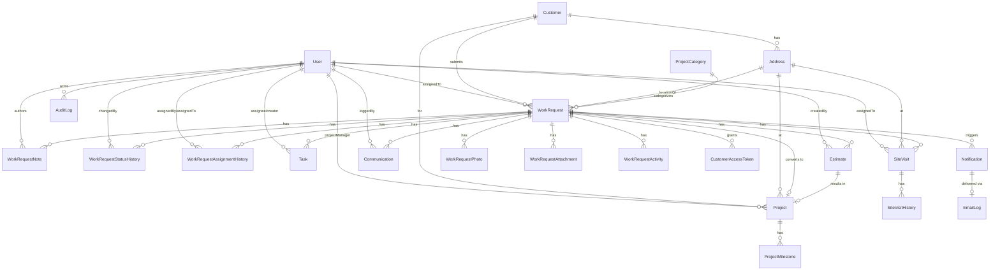

# DCS Construction — Data Model

> **Status — 2026-07-14:** This schema is **implemented** in `prisma/schema.prisma` and applied to both the local database and **production (Neon Postgres on Vercel)** via `prisma migrate deploy` in the build (Prisma 7 with the `pg` driver adapter; client generated to `lib/generated/prisma`). Two migrations: `init` and `estimate_counter`. All models exist, including `EstimateCounter`. The customer-facing status mapping, the `DCS-YYYY-NNNNNN`/`EST-YYYY-NNNNNN` number generators, and the estimate/project state machines are covered by passing unit tests; `createWorkRequest` and the estimate→project pipeline are covered by integration tests. Seed includes two full-lifecycle showcase jobs (`DCS-2026-000027`, `DCS-2026-000028`).

Normalized PostgreSQL schema via Prisma. UUID primary keys, separate human-readable request numbers, full history/audit preservation, soft-delete/archival for business records, UTC storage.

## Design rules
- **Internal IDs**: `uuid` (non-sequential) on every table.
- **Human-readable id**: `WorkRequest.requestNumber` = `DCS-YYYY-NNNNNN` (unique), generated via a per-year counter row (`RequestCounter`) inside the submission transaction.
- **Timestamps**: `createdAt` / `updatedAt` on every table; all stored UTC, displayed in company timezone.
- **Soft delete / archival**: business records use `archivedAt` (nullable) rather than hard delete. Customer submissions are never hard-deleted through normal UI.
- **History preserved**: status, assignment, and site-visit changes are append-only history tables.
- **Categories are data**: `ProjectCategory` rows; `WorkRequest` also stores `categoryNameSnapshot` to preserve the historical label even if a category is renamed.
- **Photos**: metadata + storage key only; never file bytes in the DB.
- **Indexes**: on all foreign keys, `WorkRequest(status)`, `WorkRequest(assignedToId)`, `WorkRequest(createdAt)`, `WorkRequest(requestNumber)`, and search-relevant columns.

## Entity-Relationship Diagram (Mermaid)



## Prisma schema (`prisma/schema.prisma`)

```prisma
generator client {
  provider = "prisma-client-js"
}

datasource db {
  provider = "postgresql"
  url      = env("DATABASE_URL")
}

// ----- Enums -----
enum UserRole {
  EMPLOYEE
  MANAGER
  PRINCIPAL_ADMIN
}

enum RequestStatus {
  NEW
  REVIEWING
  NEEDS_MORE_INFORMATION
  CONTACTED
  SITE_VISIT_TO_SCHEDULE
  SITE_VISIT_SCHEDULED
  SITE_VISIT_COMPLETED
  ESTIMATE_IN_PROGRESS
  ESTIMATE_SENT
  CUSTOMER_DECISION_PENDING
  APPROVED
  PROJECT_SCHEDULED
  IN_PROGRESS
  ON_HOLD
  COMPLETED
  DECLINED
  CANCELLED
  ARCHIVED
}

enum Priority {
  LOW
  NORMAL
  HIGH
  URGENT
}

enum ContactMethod {
  PHONE
  EMAIL
  TEXT
}

enum NoteVisibility {
  INTERNAL
  CUSTOMER_VISIBLE
}

enum AppointmentStatus {
  PROPOSED
  CONFIRMED
  COMPLETED
  RESCHEDULED
  CANCELLED
  NO_SHOW
}

enum EstimateStatus {
  DRAFT
  UNDER_REVIEW
  SENT
  ACCEPTED
  DECLINED
  EXPIRED
  REVISED
}

enum ProjectStatus {
  PLANNED
  IN_PROGRESS
  ON_HOLD
  COMPLETED
  CANCELLED
}

enum EmailStatus {
  QUEUED
  SENT
  DELIVERED
  FAILED
  BOUNCED
}

enum ActivityType {
  SUBMITTED
  STATUS_CHANGED
  ASSIGNED
  NOTE_ADDED
  SITE_VISIT_SCHEDULED
  SITE_VISIT_UPDATED
  ESTIMATE_SENT
  COMMUNICATION_LOGGED
  PHOTO_ADDED
  PROJECT_CREATED
}

// ----- Core users & customers -----
model User {
  id           String    @id @default(uuid())
  email        String    @unique
  name         String
  passwordHash String
  role         UserRole  @default(EMPLOYEE)
  isActive     Boolean   @default(true)
  phone        String?
  lastLoginAt  DateTime?
  createdAt    DateTime  @default(now())
  updatedAt    DateTime  @updatedAt

  assignedRequests      WorkRequest[]                @relation("AssignedEmployee")
  notes                 WorkRequestNote[]
  statusChanges         WorkRequestStatusHistory[]
  assignmentsMade       WorkRequestAssignmentHistory[] @relation("AssignedBy")
  assignmentsReceived   WorkRequestAssignmentHistory[] @relation("AssignedTo")
  tasksCreated          Task[]                       @relation("TaskCreator")
  tasksAssigned         Task[]                       @relation("TaskAssignee")
  siteVisits            SiteVisit[]
  communications        Communication[]
  auditLogs             AuditLog[]
  estimates             Estimate[]
  managedProjects       Project[]

  @@index([role])
  @@index([isActive])
}

model Customer {
  id            String    @id @default(uuid())
  fullName      String
  email         String
  phone         String
  contactMethod ContactMethod @default(PHONE)
  createdAt     DateTime  @default(now())
  updatedAt     DateTime  @updatedAt
  archivedAt    DateTime?

  addresses     Address[]
  workRequests  WorkRequest[]
  projects      Project[]

  @@index([email])
  @@index([phone])
}

model Address {
  id         String   @id @default(uuid())
  street     String
  unit       String?
  city       String
  state      String
  zip        String
  customerId String?
  customer   Customer? @relation(fields: [customerId], references: [id])
  createdAt  DateTime  @default(now())
  updatedAt  DateTime  @updatedAt

  workRequests WorkRequest[]
  siteVisits   SiteVisit[]
  projects     Project[]

  @@index([customerId])
  @@index([zip])
  @@index([city])
}

model ProjectCategory {
  id          String   @id @default(uuid())
  name        String   @unique
  description String?
  sortOrder   Int      @default(0)
  isActive    Boolean  @default(true)
  createdAt   DateTime @default(now())
  updatedAt   DateTime @updatedAt

  workRequests WorkRequest[]

  @@index([isActive])
}

// ----- Work requests -----
model WorkRequest {
  id                   String        @id @default(uuid())
  requestNumber        String        @unique            // DCS-YYYY-NNNNNN
  customerId           String
  customer             Customer      @relation(fields: [customerId], references: [id])
  addressId            String
  address              Address       @relation(fields: [addressId], references: [id])
  categoryId           String
  category             ProjectCategory @relation(fields: [categoryId], references: [id])
  categoryNameSnapshot String                             // preserves historical label
  description          String
  budgetRange          String?
  desiredTimeframe     String?
  referralSource       String?
  additionalNotes      String?
  preferredContact     ContactMethod @default(PHONE)
  permissionToContact  Boolean       @default(false)
  consentAccepted      Boolean       @default(false)
  preferredVisitDates  String?

  status               RequestStatus @default(NEW)
  priority             Priority      @default(NORMAL)
  assignedToId         String?
  assignedTo           User?         @relation("AssignedEmployee", fields: [assignedToId], references: [id])
  firstContactedAt     DateTime?
  followUpAt           DateTime?
  dueAt                DateTime?
  responseDueAt        DateTime?                          // 48 business hrs SLA target
  idempotencyKey       String?       @unique              // blocks duplicate submits

  createdAt            DateTime      @default(now())
  updatedAt            DateTime      @updatedAt
  archivedAt           DateTime?

  photos            WorkRequestPhoto[]
  attachments       WorkRequestAttachment[]
  statusHistory     WorkRequestStatusHistory[]
  assignmentHistory WorkRequestAssignmentHistory[]
  notes             WorkRequestNote[]
  activities        WorkRequestActivity[]
  tasks             Task[]
  siteVisits        SiteVisit[]
  communications    Communication[]
  estimates         Estimate[]
  accessTokens      CustomerAccessToken[]
  notifications     Notification[]
  project           Project?

  @@index([status])
  @@index([assignedToId])
  @@index([categoryId])
  @@index([customerId])
  @@index([createdAt])
  @@index([priority])
  @@index([responseDueAt])
}

model WorkRequestPhoto {
  id            String   @id @default(uuid())
  workRequestId String
  workRequest   WorkRequest @relation(fields: [workRequestId], references: [id])
  storageKey    String                       // private object-storage key (not public URL)
  fileName      String                       // sanitized
  contentType   String
  sizeBytes     Int
  width         Int?
  height        Int?
  uploadedByCustomer Boolean @default(true)
  createdAt     DateTime @default(now())

  @@index([workRequestId])
}

model WorkRequestAttachment {
  id            String   @id @default(uuid())
  workRequestId String
  workRequest   WorkRequest @relation(fields: [workRequestId], references: [id])
  storageKey    String
  fileName      String
  contentType   String
  sizeBytes     Int
  internalOnly  Boolean  @default(true)
  createdAt     DateTime @default(now())

  @@index([workRequestId])
}

model WorkRequestStatusHistory {
  id            String        @id @default(uuid())
  workRequestId String
  workRequest   WorkRequest   @relation(fields: [workRequestId], references: [id])
  fromStatus    RequestStatus?
  toStatus      RequestStatus
  reason        String?
  changedById   String?
  changedBy     User?         @relation(fields: [changedById], references: [id])
  createdAt     DateTime      @default(now())

  @@index([workRequestId])
}

model WorkRequestAssignmentHistory {
  id            String   @id @default(uuid())
  workRequestId String
  workRequest   WorkRequest @relation(fields: [workRequestId], references: [id])
  assignedToId  String?
  assignedTo    User?    @relation("AssignedTo", fields: [assignedToId], references: [id])
  assignedById  String?
  assignedBy    User?    @relation("AssignedBy", fields: [assignedById], references: [id])
  createdAt     DateTime @default(now())

  @@index([workRequestId])
}

model WorkRequestNote {
  id            String   @id @default(uuid())
  workRequestId String
  workRequest   WorkRequest @relation(fields: [workRequestId], references: [id])
  authorId      String
  author        User     @relation(fields: [authorId], references: [id])
  body          String
  visibility    NoteVisibility @default(INTERNAL)
  createdAt     DateTime @default(now())
  updatedAt     DateTime @updatedAt

  @@index([workRequestId])
}

model WorkRequestActivity {
  id            String   @id @default(uuid())
  workRequestId String
  workRequest   WorkRequest @relation(fields: [workRequestId], references: [id])
  type          ActivityType
  summary       String
  isCustomerVisible Boolean @default(false)
  metadata      Json?
  createdAt     DateTime @default(now())

  @@index([workRequestId])
  @@index([createdAt])
}

model Task {
  id            String   @id @default(uuid())
  workRequestId String
  workRequest   WorkRequest @relation(fields: [workRequestId], references: [id])
  title         String
  description   String?
  isComplete    Boolean  @default(false)
  dueAt         DateTime?
  assigneeId    String?
  assignee      User?    @relation("TaskAssignee", fields: [assigneeId], references: [id])
  createdById   String
  createdBy     User     @relation("TaskCreator", fields: [createdById], references: [id])
  completedAt   DateTime?
  createdAt     DateTime @default(now())
  updatedAt     DateTime @updatedAt

  @@index([workRequestId])
  @@index([assigneeId])
}

// ----- Scheduling -----
model SiteVisit {
  id            String   @id @default(uuid())
  workRequestId String
  workRequest   WorkRequest @relation(fields: [workRequestId], references: [id])
  addressId     String?
  address       Address? @relation(fields: [addressId], references: [id])
  assignedToId  String?
  assignedTo    User?    @relation(fields: [assignedToId], references: [id])
  scheduledDate DateTime
  startTime     DateTime?
  endTime       DateTime?
  status        AppointmentStatus @default(PROPOSED)
  internalInstructions String?
  customerInstructions String?
  cancellationReason   String?
  createdAt     DateTime @default(now())
  updatedAt     DateTime @updatedAt

  history       SiteVisitHistory[]

  @@index([workRequestId])
  @@index([assignedToId])
  @@index([scheduledDate])
}

model SiteVisitHistory {
  id          String   @id @default(uuid())
  siteVisitId String
  siteVisit   SiteVisit @relation(fields: [siteVisitId], references: [id])
  changeType  String                 // scheduled | rescheduled | cancelled | completed | no_show
  previousDate DateTime?
  newDate      DateTime?
  reason       String?
  createdAt   DateTime @default(now())

  @@index([siteVisitId])
}

model Communication {
  id            String   @id @default(uuid())
  workRequestId String
  workRequest   WorkRequest @relation(fields: [workRequestId], references: [id])
  loggedById    String
  loggedBy      User     @relation(fields: [loggedById], references: [id])
  channel       String                 // phone | email | text | in_person
  direction     String                 // inbound | outbound
  summary       String
  occurredAt    DateTime @default(now())
  createdAt     DateTime @default(now())

  @@index([workRequestId])
}

// ----- Estimates & projects -----
model Estimate {
  id             String   @id @default(uuid())
  estimateNumber String   @unique          // EST-YYYY-NNNNNN
  workRequestId  String
  workRequest    WorkRequest @relation(fields: [workRequestId], references: [id])
  status         EstimateStatus @default(DRAFT)
  description    String?
  amount         Decimal? @db.Decimal(12, 2)
  sentAt         DateTime?
  expiresAt      DateTime?
  internalNotes  String?
  customerNotes  String?
  attachmentKey  String?                    // externally generated PDF
  createdById    String?
  createdBy      User?    @relation(fields: [createdById], references: [id])
  createdAt      DateTime @default(now())
  updatedAt      DateTime @updatedAt

  project        Project?

  @@index([workRequestId])
  @@index([status])
}

model Project {
  id                 String   @id @default(uuid())
  name               String
  workRequestId      String?  @unique
  workRequest        WorkRequest? @relation(fields: [workRequestId], references: [id])
  estimateId         String?  @unique
  estimate           Estimate?    @relation(fields: [estimateId], references: [id])
  customerId         String
  customer           Customer @relation(fields: [customerId], references: [id])
  addressId          String?
  address            Address? @relation(fields: [addressId], references: [id])
  projectManagerId   String?
  projectManager     User?    @relation(fields: [projectManagerId], references: [id])
  status             ProjectStatus @default(PLANNED)
  contractAmount     Decimal? @db.Decimal(12, 2)
  plannedStartDate   DateTime?
  plannedEndDate     DateTime?
  actualStartDate    DateTime?
  actualEndDate      DateTime?
  internalNotes      String?
  createdAt          DateTime @default(now())
  updatedAt          DateTime @updatedAt
  archivedAt         DateTime?

  milestones         ProjectMilestone[]

  @@index([customerId])
  @@index([status])
}

model ProjectMilestone {
  id          String   @id @default(uuid())
  projectId   String
  project     Project  @relation(fields: [projectId], references: [id])
  title       String
  description String?
  dueAt       DateTime?
  completedAt DateTime?
  sortOrder   Int      @default(0)
  createdAt   DateTime @default(now())
  updatedAt   DateTime @updatedAt

  @@index([projectId])
}

// ----- Notifications, email, tokens, settings, audit -----
model Notification {
  id            String   @id @default(uuid())
  workRequestId String?
  workRequest   WorkRequest? @relation(fields: [workRequestId], references: [id])
  recipientType String                 // customer | employee | admin
  recipient     String                 // email or userId
  template      String
  channel       String   @default("email")
  createdAt     DateTime @default(now())

  emailLog      EmailLog?

  @@index([workRequestId])
}

model EmailLog {
  id               String   @id @default(uuid())
  notificationId   String?  @unique
  notification     Notification? @relation(fields: [notificationId], references: [id])
  recipient        String
  template         String
  relatedRequestId String?
  status           EmailStatus @default(QUEUED)
  providerMessageId String?
  errorMessage     String?
  retryCount       Int      @default(0)
  createdAt        DateTime @default(now())
  updatedAt        DateTime @updatedAt

  @@index([status])
  @@index([relatedRequestId])
}

model CustomerAccessToken {
  id            String   @id @default(uuid())
  workRequestId String
  workRequest   WorkRequest @relation(fields: [workRequestId], references: [id])
  tokenHash     String   @unique          // store hash, never the raw token
  expiresAt     DateTime
  usedAt        DateTime?
  createdAt     DateTime @default(now())

  @@index([workRequestId])
}

model CompanySetting {
  id                  String   @id @default(uuid())
  key                 String   @unique
  value               Json
  updatedAt           DateTime @updatedAt
  createdAt           DateTime @default(now())
}

model AuditLog {
  id          String   @id @default(uuid())
  actorId     String?
  actor       User?    @relation(fields: [actorId], references: [id])
  action      String                  // e.g. USER_ROLE_CHANGED, STATUS_CHANGED
  entityType  String
  entityId    String?
  metadata    Json?
  ipAddress   String?
  createdAt   DateTime @default(now())

  @@index([actorId])
  @@index([entityType])
  @@index([createdAt])
}

// Per-year counter for human-readable request numbers (row-locked in txn)
model RequestCounter {
  year      Int      @id
  lastValue Int      @default(0)
  updatedAt DateTime @updatedAt
}

// Per-year counter for human-readable estimate numbers (EST-YYYY-NNNNNN),
// added in Phase 6 — allocated exactly like RequestCounter, inside a txn.
model EstimateCounter {
  year      Int      @id
  lastValue Int      @default(0)
  updatedAt DateTime @updatedAt
}
```

## Request-number generation
Inside the submission transaction:
1. `SELECT ... FOR UPDATE` (Prisma: `$transaction` with an `update`) the `RequestCounter` row for the current year (create if absent).
2. Increment `lastValue`.
3. Format `DCS-${year}-${String(lastValue).padStart(6,'0')}`.
This guarantees uniqueness under concurrency without exposing a sequential internal ID.

## Customer-visible status mapping
| Internal | Customer-facing |
|---|---|
| NEW, REVIEWING | Request Received / Under Review |
| NEEDS_MORE_INFORMATION | Action Needed |
| CONTACTED, SITE_VISIT_TO_SCHEDULE | Under Review |
| SITE_VISIT_SCHEDULED | Site Visit Scheduled |
| SITE_VISIT_COMPLETED, ESTIMATE_IN_PROGRESS | Estimate Being Prepared |
| ESTIMATE_SENT, CUSTOMER_DECISION_PENDING | Estimate Sent |
| APPROVED, PROJECT_SCHEDULED | Project Scheduled |
| IN_PROGRESS, ON_HOLD | Work in Progress |
| COMPLETED | Completed |
| DECLINED, CANCELLED, ARCHIVED | Closed |
